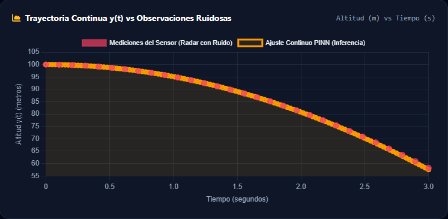
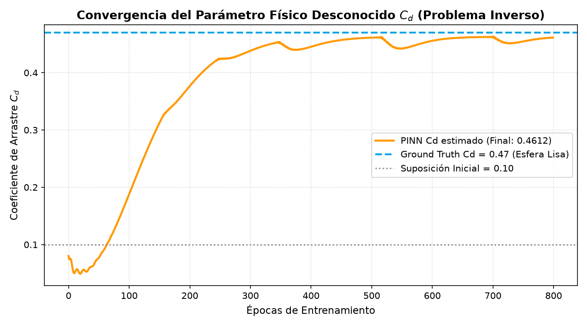
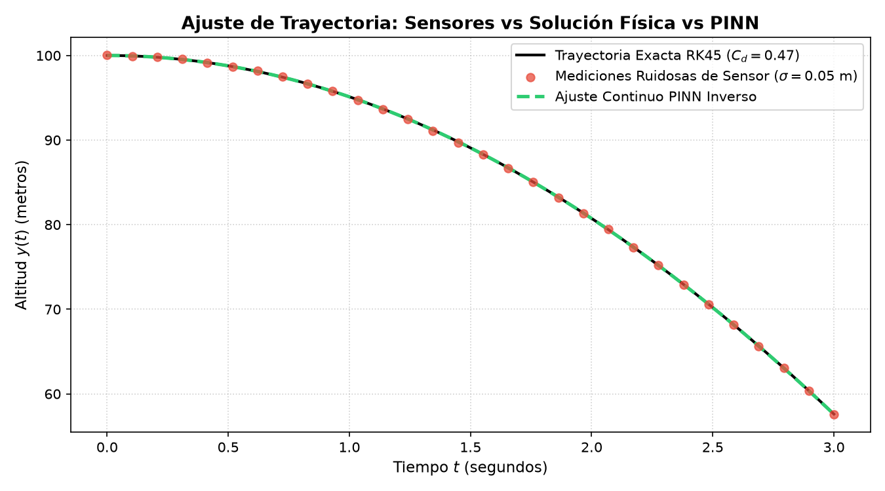
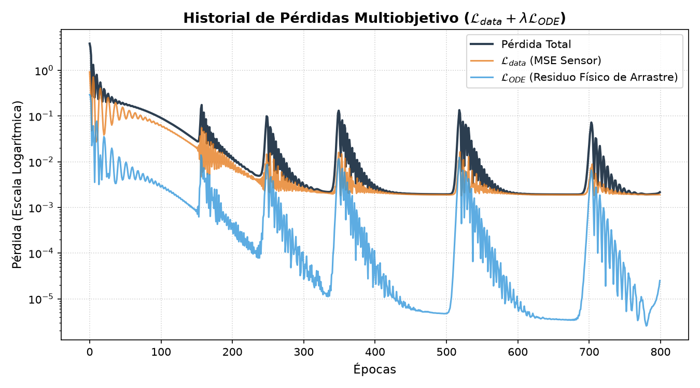
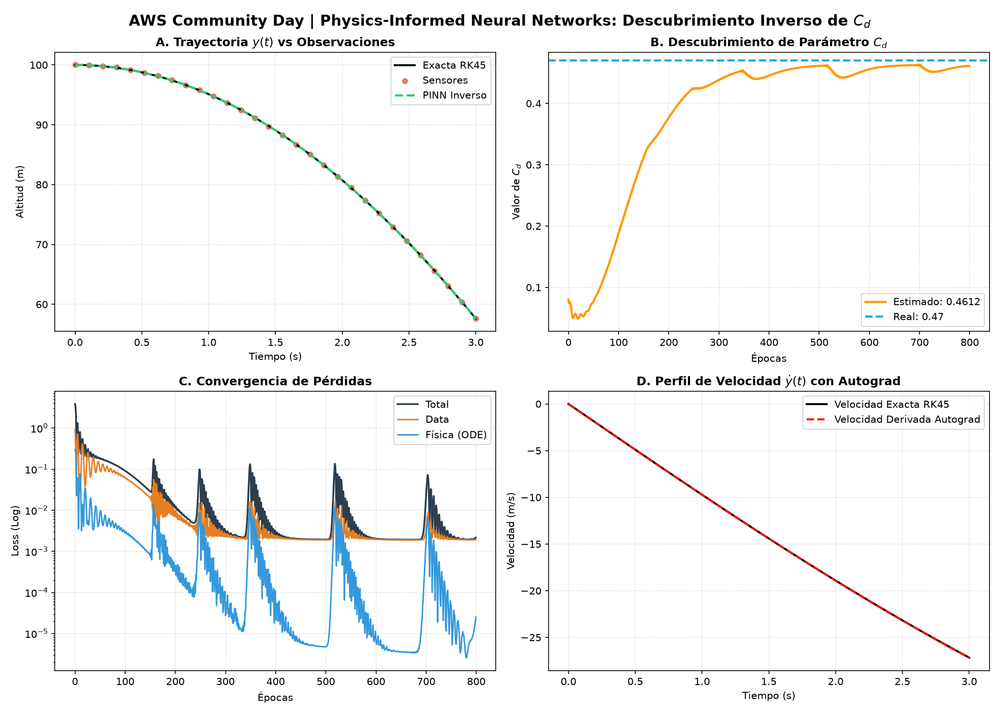

# Descubrimiento Inverso de Coeficiente de Arrastre ($C_d$) — Physics-Informed Neural Network (PINN) en AWS

[](https://github.com/JeffersonConza/pinn_inverso_cd)
[](https://pytorch.org/)
[](https://fastapi.tiangolo.com/)
[](LICENSE)

Implementación, entrenamiento, diagnóstico analítico y despliegue en la nube de una **Red Neuronal Informada por la Física (PINN)** diseñada para resolver **problemas inversos de calibración de parámetros en tiempo real**: **descubrir el coeficiente aerodinámico de arrastre ($C_d$)** a partir de observaciones discretas y ruidosas de la trayectoria de un cuerpo en caída libre bajo resistencia cuadrática:

$$
m \frac{d^2 y}{dt^2} = -m g - \frac{1}{2} \rho A \cdot \mathbf{C_d} \cdot \left(\frac{dy}{dt}\right)\left|\frac{dy}{dt}\right|
$$

| Parámetro Físico | Notación | Valor / Definición Canónica |
|---|---|---|
| Masa del cuerpo | $m$ | $1.0\text{ kg}$ (Esfera lisa) |
| Gravedad terrestre | $g$ | $9.81\text{ m/s}^2$ |
| Densidad del aire | $\rho$ | $1.225\text{ kg/m}^3$ (Nivel del mar) |
| Área frontal transversal | $A$ | $0.01\text{ m}^2$ |
| **Coeficiente de Arrastre Real** | $\mathbf{C_d^{\text{true}}}$ | $\mathbf{0.4700}$ (Ground Truth a descubrir) |
| Suposición Inicial Ciega | $C_d^{\text{guess}}$ | $0.1000$ (Punto de partida ciego) |
| Condición Inicial de Posición | $y(0)$ | $100.0\text{ m}$ |
| Condición Inicial de Velocidad | $\dot{y}(0)$ | $0.0\text{ m/s}$ (Desde reposo) |

---

## 🌟 Visualizador Web Interactivo en Tiempo Real (`/demo`)

El microservicio incluye un panel web interactivo desplegado sobre **FastAPI**, **TailwindCSS** y **Chart.js** en AWS EC2, con generador de **Código QR para la audiencia**, inferencia y calibración inversa en $< 300\text{ ms}$:

<div align="center">
  
  <p><i>Figura 1: Visualizador en vivo con selector de presets físicos, simulación de ruido gaussiano de radar, código QR para móviles y telemetría de latencia en AWS EC2.</i></p>
</div>

---

## 📁 Estructura del Proyecto

```text
pinn_inverso_cd/
├── api/
│   └── main.py                  # API REST con FastAPI, validación Pydantic, visualizador /demo, código QR y sync S3
├── data/
│   ├── cd_convergence.png       # Curva de convergencia de Cd estimado vs Ground Truth
│   ├── interactive_demo_preview.png # Captura del visualizador interactivo en vivo
│   ├── inverse_discovery_dashboard.png # Panel multipane resumen 4 en 1
│   ├── loss_history.png         # Curvas de pérdida de datos (MSE) y residual físico (ODE)
│   ├── synthetic_measurements.csv # Dataset sintético exportado con mediciones ruidosas
│   └── trajectory_discovery.png # Ajuste PINN vs Ground Truth vs Puntos de sensor
├── models/
│   ├── inverse_drag_pinn.pt     # Pesos y valor calibrado de Cd (state_dict)
│   └── inverse_drag_script.pt   # Modelo serializado en TorchScript
├── src/
│   ├── config.py                # Parámetros físicos, arquitectura y configuración central
│   ├── physics_engine.py        # Integrador numérico RK45 y simulador de telemetría de radar
│   ├── pinn_inverse.py          # Red InverseDragPINN con autograd y parámetro aprendible Cd
│   ├── train.py                 # Pipeline de entrenamiento maestro y generación de figuras
│   └── upload_s3.py             # Sincronización automática de modelos con Amazon S3
├── .env                         # Variables de entorno locales y AWS
├── .gitignore                   # Exclusiones de Git
├── deploy_ec2_userdata.sh       # Script User-Data automatizado para EC2 (Ubuntu / AL2023)
├── requirements.txt             # Dependencias del proyecto
├── test_api.py                  # Script de pruebas automatizadas de integración y endpoints
└── README.md                    # Documentación técnica
```

---

## 🧠 Formulación Matemática y Problema Inverso

A diferencia de los problemas directos donde se conocen todos los coeficientes de la ecuación diferencial, en los **problemas inversos** la red descubre los parámetros ocultos del sistema mientras aprende la solución:

```
  [ Sensores Ruidosos (t_i, y_i) ] ──┐
                                     ├──> [ PINN + autograd ] ──> 🎯 Descubrimiento en vivo de C_d
  [ Ley Física de Newton (ODE) ] ────┘                            ⚡ Calibración continua en < 300 ms
```

### 1. Base Cinemática Informada
Para garantizar estabilidad numérica y satisfacer exactamente las condiciones iniciales $y(0) = y_0$ y $\dot{y}(0) = v_0$:

$$
y_{\theta}(t) = y_0 + v_0 t - \frac{1}{2} g t^2 + \text{NN}(t; \theta) \cdot t^2
$$

Las derivadas continuas se evalúan analíticamente mediante **PyTorch Autograd**:

$$
v_{\theta}(t) = \frac{\partial y_{\theta}}{\partial t}, \quad a_{\theta}(t) = \frac{\partial^2 y_{\theta}}{\partial t^2}
$$

### 2. Función de Pérdida Compuesta Dual

$$
\mathcal{L}_{\text{total}}(\theta, C_d) = \mathcal{L}_{\text{data}}(\theta) + \lambda \mathcal{L}_{\text{ODE}}(\theta, C_d)
$$

Donde:

- **Pérdida de Observaciones de Sensores ($\mathcal{L}_{\text{data}}$):**

$$
\mathcal{L}_{\text{data}} = \frac{1}{N} \sum_{i=1}^{N} \left| y_{\theta}(t_i) - y_{\text{sensor}}(t_i) \right|^2
$$

- **Residuo Físico de la ODE ($\mathcal{L}_{\text{ODE}}$):**

$$
\mathcal{L}_{\text{ODE}} = \frac{1}{N_{\text{col}}} \sum_{j=1}^{N_{\text{col}}} \left| a_{\theta}(t_j) + g + \frac{\rho A}{2m} \mathbf{C_d} \cdot v_{\theta}(t_j) |v_{\theta}(t_j)| \right|^2
$$

---

## 🎨 Galería de Diagnóstico y Resultados SciML

<div align="center">
  <table style="width:100%; border:none;">
    <tr>
      <td width="50%" align="center">
        
        <br/><i>Figura 2: Evolución de $C_d$ desde la suposición ciega ($0.10$) hacia el valor real ($0.47$).</i>
      </td>
      <td width="50%" align="center">
        
        <br/><i>Figura 3: Trayectoria continua recuperada frente a mediciones ruidosas.</i>
      </td>
    </tr>
    <tr>
      <td width="50%" align="center">
        
        <br/><i>Figura 4: Convergencia de pérdidas en escala semilogarítmica.</i>
      </td>
      <td width="50%" align="center">
        
        <br/><i>Figura 5: Dashboard integrado 4 en 1 para análisis SciML.</i>
      </td>
    </tr>
  </table>
</div>

---

## ⚙️ Instalación y Configuración Local

### 1. Clonar el Repositorio y Crear Entorno Virtual

```bash
git clone https://github.com/JeffersonConza/pinn_inverso_cd.git
cd pinn_inverso_cd
```

**Linux / macOS / WSL:**
```bash
python3 -m venv venv
source venv/bin/activate
pip install -r requirements.txt
```

**Windows (PowerShell):**
```powershell
python -m venv venv
venv\Scripts\activate
pip config set global.trusted-host "pypi.org files.pythonhosted.org pypi.python.org download.pytorch.org"
pip install -r requirements.txt
```

### 2. Configurar Variables de Entorno (`.env`)

```env
PORT=8000
HOST=0.0.0.0
MODEL_PATH=models/inverse_drag_pinn.pt
S3_BUCKET=pinns-inverso-cd-jconza
S3_MODEL_KEY=models/inverse_drag_pinn.pt
```

---

## 🎯 Hiperparámetros y Configuración (`src/config.py`)

| Parámetro | Descripción | Valor Canónico |
|---|---|---|
| `INPUT_DIM` / `OUTPUT_DIM` | Dimensión de entrada ($t$) y salida ($y$) | `1` / `1` |
| `NUM_HIDDEN_LAYERS` | Cantidad de capas densas intermedias | `3` |
| `HIDDEN_NEURONS` | Neuronas por capa oculta | `64` |
| `ACTIVATION` | Función de activación continua | `Tanh` |
| `CD_INITIAL_GUESS` | Suposición inicial para $C_d$ | `0.10` |
| `EPOCHS` (Offline) | Épocas de optimización maestro | `800` |
| `FAST_CALIBRATION_EPOCHS` | Épocas para calibración rápida en vivo | `120` |
| `WEIGHT_DATA` / `WEIGHT_ODE` | Pesos de la función de pérdida | `1.0` / `20.0` |

---

## 🌐 API Web FastAPI y Endpoints

### Iniciar el Servidor:
```bash
python -m uvicorn api.main:app --host 0.0.0.0 --port 8000 --reload
```

### Catálogo de Endpoints:

| Método | Endpoint | Descripción |
|---|---|---|
| `GET` | `/demo` | **Visualizador web interactivo** con Chart.js, Tailwind y telemetría en tiempo real. |
| `GET` | `/docs` | Documentación interactiva OpenAPI / Swagger UI. |
| `GET` | `/health` | Estado del microservicio y modelo cargado en RAM. |
| `GET` | `/presets` | Lista de casos físicos preconfigurados (*Esfera*, *Béisbol*, *Cohete*, *Paracaidista*). |
| `POST` | `/discover_cd` | **Calibración inversa en vivo (< 300 ms)** descubriendo $C_d$ a partir de telemetría. |

> **🎮 Atajos de Teclado para el Ponente:**
> - `Barra Espaciadora` / `Enter`: Ejecutar descubrimiento inverso de $C_d$ en tiempo real.
> - `1`: Preset 🏀 Esfera Lisa ($C_d = 0.47$).
> - `2`: Preset ⚾ Pelota de Béisbol ($C_d = 0.30$).
> - `3`: Preset 🚀 Cilindro / Cohete ($C_d = 0.82$).
> - `4`: Preset 🪂 Paracaidista ($C_d = 1.20$).
> - `Q`: Abrir / Cerrar el modal del **Código QR para la audiencia móvil**.

### Ejecución de Pruebas Automatizadas
```bash
pytest test_api.py -v
```

---

## ☁️ Despliegue en Producción en AWS (S3 $\to$ IAM $\to$ EC2)

El proyecto implementa un patrón desacoplado, seguro y de bajo costo sobre **Amazon Web Services**:

```
[Entrenamiento Local / CI] ──(boto3)──> 📦 Amazon S3 (pinns-inverso-cd-jconza)
                                               │
                                         (IAM Role: s3:GetObject)
                                               │
                                               ▼
                                        🖥️ Amazon EC2 (t3.medium / Ubuntu 24.04)
                                               │── UserData (deploy_ec2_userdata.sh)
                                               │── 2 GB Memoria SWAP
                                               │── PyTorch CPU Optimizado (~180 MB)
                                               │── Servicio systemd (pinn-inverse-api)
                                               ▼
                                     🌐 Inferencia Global & /demo (:8000)
```

### Aprovisionamiento con AWS CLI:
```bash
aws ec2 run-instances \
    --image-id ami-0c55b159cbfafe1f0 \
    --instance-type t3.medium \
    --key-name <YOUR_KEY_PAIR> \
    --security-group-ids <YOUR_SECURITY_GROUP> \
    --user-data file://deploy_ec2_userdata.sh \
    --tag-specifications 'ResourceType=instance,Tags=[{Key=Name,Value=pinns-inverso-cd-jconza}]'
```

### Métricas de Rendimiento en AWS:
* **Latencia de Inferencia Puntual (`GET /predict`):** $< 1.0\text{ ms}$.
* **Latencia de Calibración Inversa (`POST /discover_cd`):** $< 300\text{ ms}$ (en CPU de `t3.medium`).
* **Costo Estimado de Ejecución:** $\approx \$0.0416\text{ USD/hora}$ ($< \$0.10\text{ USD}$ por demostración completa).

---

## 👤 Autor

* **Jefferson Alfredo Conza Fajardo**
* Estudiante de Matemática — Universidad Yachay Tech
* Cloud Application Developer — AWS Cloud Institute (ACI)
* GitHub: [@JeffersonConza](https://github.com/JeffersonConza)
* Repositorio: [pinn_inverso_cd](https://github.com/JeffersonConza/pinn_inverso_cd)
